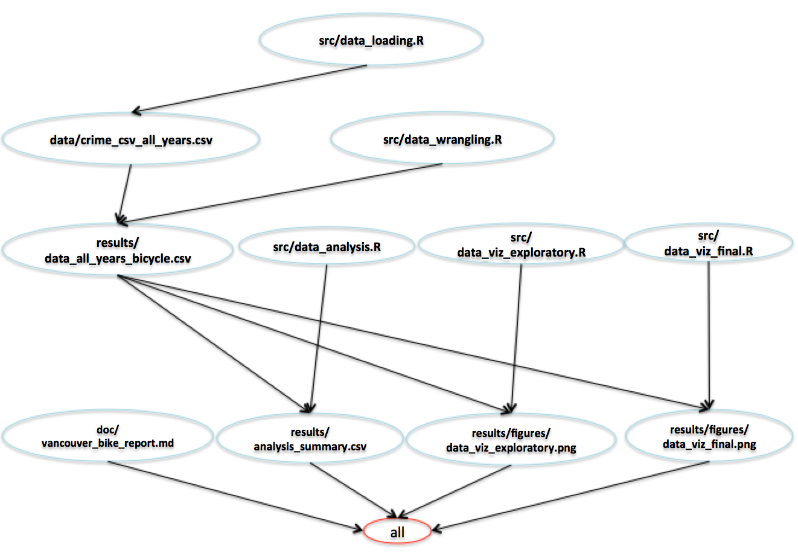

# Vancouver Bike Theft Analysis
Analysis of bike theft reports in Vancouver between 2003-2017.

### Team Members | Github.com username:
* Fan Nie | Jamienie
* Mohamad Makkaoui | makka3

## Introduction
Even in an age of CCTV cameras on every street corner, bike theft remains an issue that continues to plague most modern cities. 
Vancouver, Canada is no exception and there are often hundreds of bike theft reports every month. The Vancouver Police Department has 
collected data on bike thefts going back to 2003, with data such as date, time, and location of all bike thefts in the greater Vancouver area.
Using this data, we will be investigating whether there is a greater incidence of bike thefts in the summer time when compared to the remaining months of the year.
(Note: for the purposes of the analysis, 'summer time' is chosen as the months June, July, August for simplicity). 

## Question

* Is the mean number of bikes stolen per month in the summer time (June, July, August) **greater** than the mean number of bikes stolen per month during the other months of the year? 

#### Variables

* Number of bikes stolen per month: Continuous
* Summer/Not Summer: Categorical

## Dataset

* The source of the dataset is available publicly on [Vancouver Open Data Catalogue](https://data.vancouver.ca/datacatalogue/crime-data.htm). It is crime data in Vancouver from 2003 till present (updated every Sunday morning) reported by the Vancouver Police Department. The dataset we use is as of November 16,2018.
* The original dataset was in csv format. For this project, we will use R to import and handle our data analysis.
* Imported data can be found [here](https://github.com/UBC-MDS/DSCI_522_Vancouver_Bike_Theft_Analysis/tree/master/data), in the data folder of the repository.

## Reproducing the analysis

### Running `make all`

1. Clone this repo or download it. Navigate to the directory using `cd` in your terminal. 
2. To clean the folder of the files (images, csv) from previous analyses, run `make clean`
3. Run the `make all` command at the terminal to produce the report with the analysis.

### Manually

1. Clone this repo, navigate to the root of the project
2. Run the following commands

```
Rscript data_loading.R "ftp://webftp.vancouver.ca/opendata/csv/crime_csv_all_years.zip"   "../data"
Rscript data_wrangling.R "../data/crime_csv_all_years.csv" "../results/data_all_years_bicycle.csv"
Rscript data_analysis.R "../results/data_all_years_bicycle.csv"  "../results/analysis_summary.csv" 
Rscript data_viz_exploratory.R "../results/data_all_years_bicycle.csv"  "../results/figures/viz_exploratory.png"
Rscript data_viz_final.R "../results/data_all_years_bicycle.csv" "../results/figures/bike_boxplot.png"
Rscript -e "rmarkdown::render('../doc/vancouver_bike_report.Rmd')"
```

## Dependency Diagram



## Dependencies
- R 3.5.1 & libraries:
	- 'rmarkdown==1.10'
	- 'here==0.1.11'
	- 'knitr==1.20'
	- 'ggplot2==3.0.0'
	- 'tidyverse==1.2.1'
	- 'broom==0.5.0'
	- 'forcats==0.3.0'