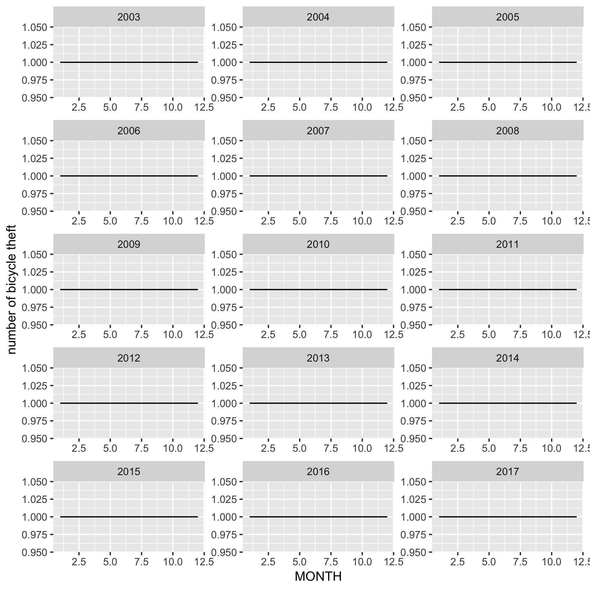
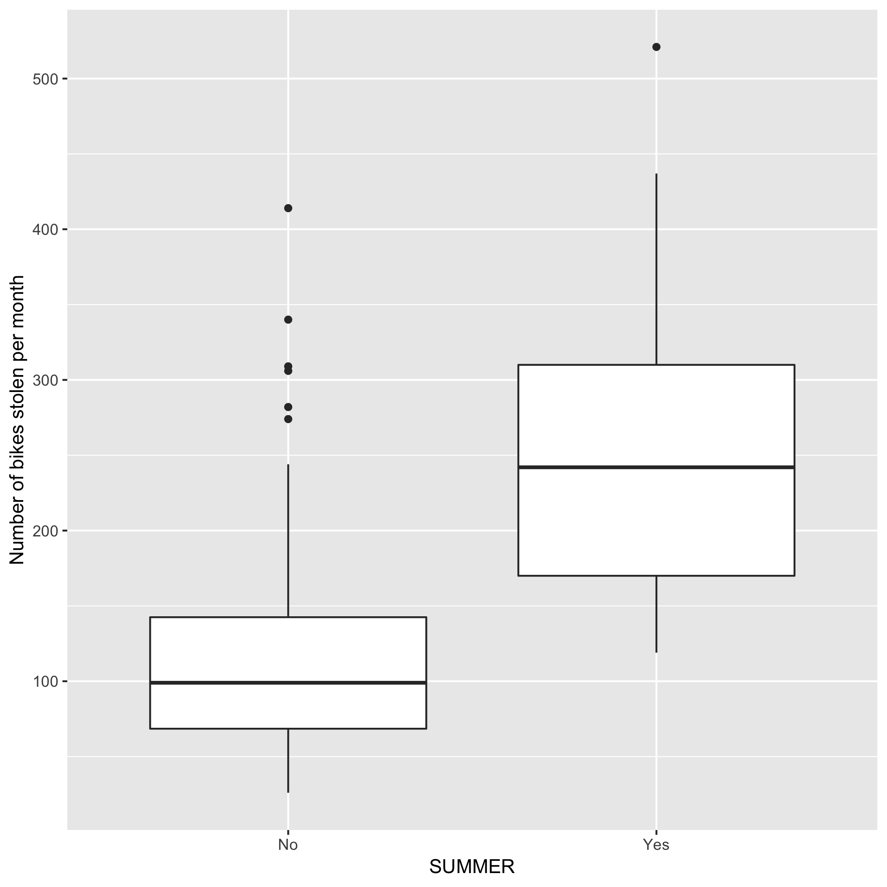

Vancouver Bike Theft Report
================

Introduction

Even in an age of CCTV cameras on every street corner, bike theft
remains an issue that continues to plague most modern cities. Vancouver,
Canada is no exception and there are often hundreds of bike theft
reports every month. The Vancouver Police Department has collected data
on bike thefts going back to 2003, with data such as date, time, and
location of all bike thefts in the greater Vancouver area.

Taking only the date data, we will be investigating whether there is a
greater incidence of bike thefts in the summer time when compared to the
remaining months of the year. (Note: for the purposes of the analysis,
‘summer time’ is chosen as the months June, July, August for
simplicity).

Our question is as follows:

Is the mean number of bikes stolen per month in the summer time (June,
July, August) greater than the mean number of bikes stolen per month
during the other months of the year or is it equally likely.

Our exploratory variable is a binary variable, ‘summer’ or ‘not summer’

First, we want to plot the months of the year vs the number of bike
thefts per month. As we have data over 14 years, the plot will be
facetted by year.

 Figure 1: Month vs. Number of
bike thefts per month over 15 years

It looks as though there is a hump whenever it approaches summer time
and a subsequent drop off as the fall begins in almost every year.

Figure 2: Box plot comparing the number of reported bike thefts for
summer and non-summ er months. Displayed on each plot are the medians,
1st/3rd quartiles, min/max, and outliers of each group.

Conclusion 
