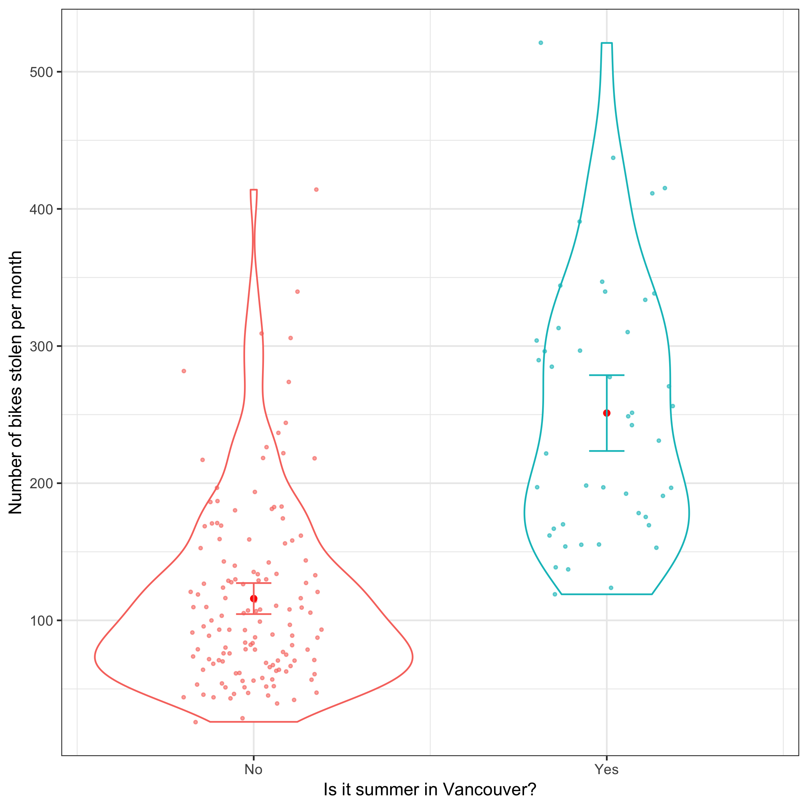

Vancouver Bike Theft Report
================
Fan Nie, Mohamad Makkaoui

## Introduction

Even in an age of CCTV cameras on every street corner, bike theft
remains an issue that continues to plague most modern cities. Vancouver,
Canada is no exception and there are often hundreds of bike theft
reports every month. The Vancouver Police Department has collected data
on bike thefts going back to 2003, with data such as date, time, and
location of all bike thefts in the greater Vancouver area.

## Question

Taking only the date data, we will be investigating whether there is a
greater incidence of bike thefts in the summer time when compared to the
remaining months of the year. (Note: for the purposes of the analysis,
‘summer time’ is chosen as the months June, July, August for
simplicity).

Our question is as follows:

Is the mean number of bikes stolen per month in the **summer time**
(June, July, August) *greater* than the mean number of bikes stolen per
month during the **other months of the year** or is it equally likely.

We will define our null and alternative hypotheses (a one-tailed
two-group hypothesis):

  - Null hypothesis \(H_0\): No difference in bike theft reports between
    summer months (June,July,August) and the other months of the year.

  - Alternative hypothesis \(H_A\): Higher number of bike theft reports
    in the summer months when compared to the other months of the year.

Our exploratory variable is a binary variable, **‘Summer’** or **‘Not
Summer’**

First, we want to plot the months of the year vs the number of bike
thefts per month. As we have data over 14 years, the plot will be
facetted by year.

 **Figure 1**: Month
vs. Number of bike thefts per month over 15 years

It looks as though there is a hump whenever it approaches summer time
and a subsequent drop off as the fall begins in almost every year. We
want to investigate this difference statistically.

## Analysis & Results

To test whether there is a statistically significant difference between
the summer and non-summer groups, we perform a t-test on the difference
in means between the two groups.

| Method                  | Statistic | p Value       |
| ----------------------- | --------- | ------------- |
| Two Sample t-test       | \-10.5    | 2.17 x 10^-20 |
| Welch Two Sample t-test | \-8.88    | 1.73 x 10^-12 |

If we assume that the two groups variance is equal or different, the
p-value is infinitesmally small (Results can be seen in
`results/analysis_summary.csv`). Thus we can easily reject the null
hypothesis and say with an extremely high level of confidence that there
is a higher incidence of bike thefts in the summer time.

**Figure 2**: Jitter/Violin plot comparing the number of reported bike
thefts for summer and non-summer months. Displayed on each plot are the
medians, 1st/3rd quartiles, min/max, and outliers of each group.

## Conclusion

In the analysis performed above, we show conclusively that there is
indeed a spike in bike theft report incidence in the summer time going
back the last 15 years. This analysis was straightforward and was
expected given our exploratory analysis and eye-test results. To make
this analysis better and more thorough/useful, we can compound datetime
data with location data to pinpoint exactly the locations and time of
day/year where the risk of bike thefts is highest. This could help the
VPD alert locals and help protect people’s property.
